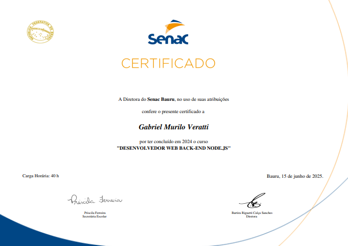

# API de Gestão para Pet Shop

API RESTful desenvolvida como parte do curso **Desenvolvedor Web Back-end Node.js** do Senac. O projeto consiste em um sistema de gerenciamento para um pet shop, permitindo o controle de clientes, pets, produtos, categorias e vendas.

---

## ✨ Funcionalidades

* **Gerenciamento completo (CRUD)** para as principais entidades:
    * Usuários
    * Clientes e seus Pets
    * Produtos
    * Categorias e Subcategorias
    * Vendas
* **Autenticação de Rota** com JSON Web Tokens (JWT) para proteger os endpoints.
* **Documentação Interativa** da API com Swagger, permitindo testar os endpoints diretamente pelo navegador.
* **Banco de Dados** com schema controlado por migrations e populado com dados iniciais através de seeders.
* **Estrutura de Projeto** organizada seguindo o padrão MVC (Model-View-Controller).

---

## 🚀 Tecnologias Utilizadas

* **Back-end:** Node.js
* **Framework:** Express.js
* **Banco de Dados:** SQLite
* **ORM:** Sequelize
* **Autenticação:** JSON Web Token (JWT)
* **Validação e Criptografia:** Bcrypt
* **Documentação:** Swagger (swagger-ui-express e swagger-jsdoc)
* **Variáveis de Ambiente:** Dotenv

---

## 📂 Estrutura do Projeto

O projeto segue uma arquitetura baseada no padrão MVC para garantir a separação de responsabilidades:

```bash
/src
|-- /config       # Configuração do banco de dados e outros
|-- /controllers  # Lógica de negócio da aplicação
|-- /data         # Arquivo do banco de dados SQLite
|-- /middleware   # Middlewares, como o de autenticação
|-- /models       # Modelos de dados do Sequelize
|-- /routes       # Definição das rotas da API
|-- /testes       # Testes unitários
`-- server.js     # Arquivo principal para iniciar o servidor
```
---

## ⚙️ Como Executar o Projeto

1.  **Clone o repositório:**
    ```bash
    git clone https://github.com/gmveratti/rest-api-senac.git
    ```

2.  **Acesse a pasta do projeto:**
    ```bash
    cd rest-api-senac
    ```

3.  **Instale as dependências:**
    ```bash
    npm install
    ```

4.  **Crie o arquivo de variáveis de ambiente:**
    Crie um arquivo `.env` na raiz do projeto e adicione a chave secreta para o JWT:
    ```env
    SECRET_KEY=sua_chave_secreta_super_segura
    ```

5.  **Execute as migrations para criar as tabelas:**
    ```bash
    npm run migrate
    ```

6.  **Execute os seeders para popular o banco de dados:**
    ```bash
    npm run seed
    ```

7.  **Inicie o servidor:**
    ```bash
    npm start
    ```
    A API estará rodando em `http://localhost:3000`.

---

## 📚 Endpoints da API

A documentação completa e interativa de todos os endpoints está disponível através do Swagger UI. Após iniciar o servidor, acesse:

[http://localhost:3000/api-docs](http://localhost:3000/api-docs)

---

## 👨‍🏫 Autor

* **Aluno:** Gabriel Veratti
* **Instrutor:** Edson Dionizio


## 📜 Certificado de Conclusão

Este projeto foi desenvolvido como parte dos requisitos para a conclusão do curso **Desenvolvedor Web Back-end Node.js** no Senac. Abaixo, o certificado de conclusão.

[](docs/certificadosenac.png)
